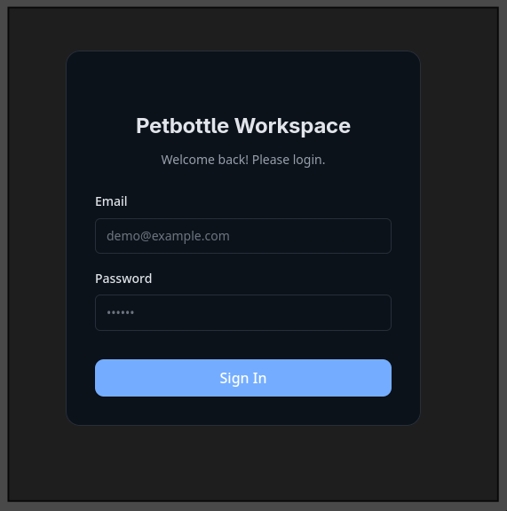
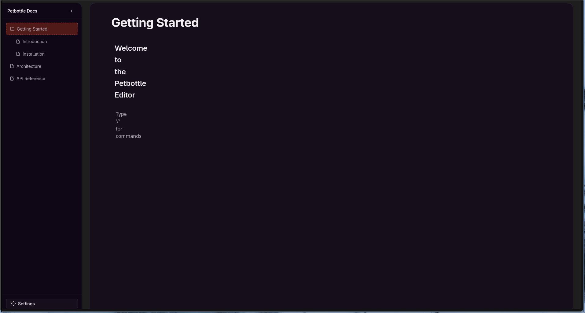
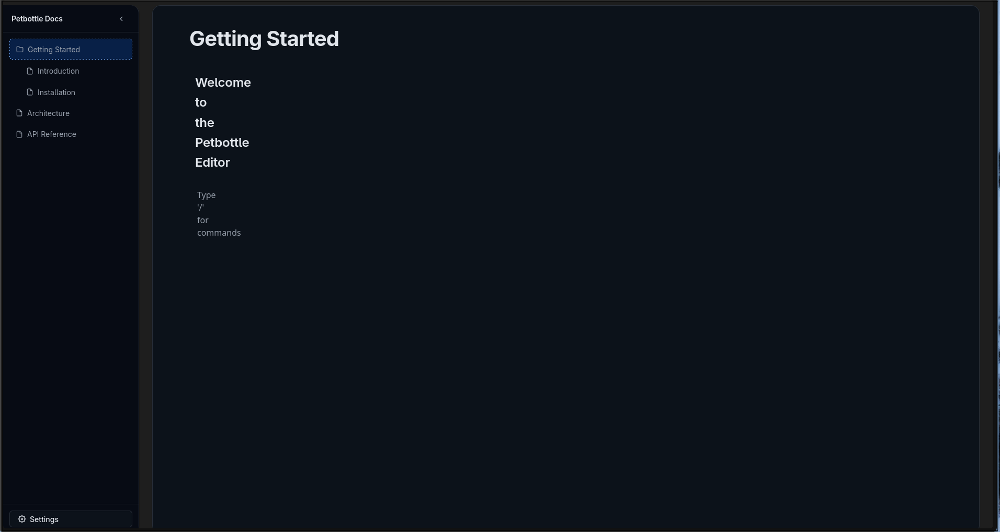
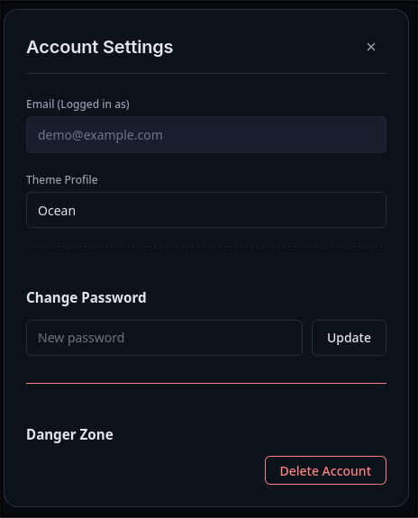

## Petbottle UI Kütüphanesi

- Petbottle-public projesi için özel olarak hazırlanmış CSS kütüphanesi.
- .[index.html] ve index2.html dosyaları kütühanenin ön izlemesi için hazırlanmış demolardır.
- [dist/css/petbottle.min.css](./dist/css/petbottle.min.css) (sıkıştırılmış sürüm) veya `src/styles/main.css` dosyası ile kütüphaneyi doğrudan kullanabilirsiniz.

## Ekran Görüntüleri (Önizleme)

  
  
  
  

